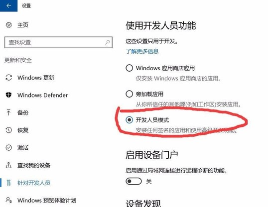
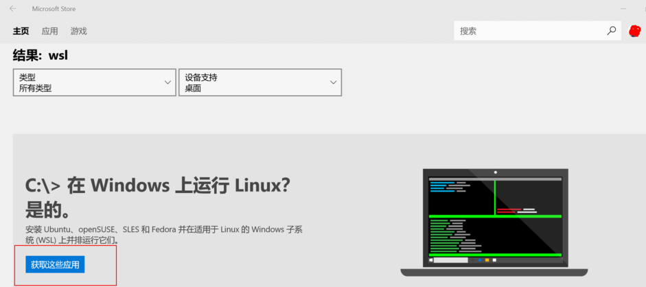
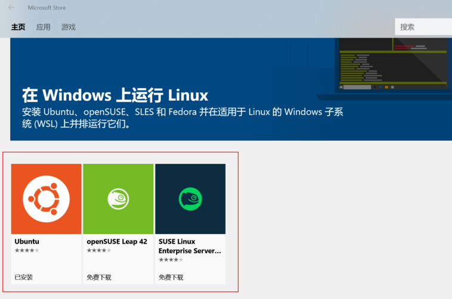
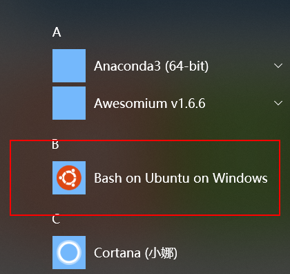

# win10子系统Ubuntu安装及配置zsh和oh-my-zsh
***
## Bash on Unbuntu on Windows --> WSL(Windwos Subsystem for Linux)
### Step 1
  

### Step 2
  
  

### Step3

### Step4
- 打开cmd输入bash即可开始下载，下载完成后自动安装，然后会让你输入UNIX用户名和密码，安装输入即可
### Step5
安装完成后可以在开始菜单中找到 **Bash on Unbuntu on Windows**  

## 安装zsh
<pre>
sudo apt-get update 更新软件源信息
sudo apt-get install zsh 安装zsh
zsh --version 确认是否安装成功
sudo chsh -s $(which zsh) 设置zsh为默认shell
echo $SHELL 确认zsh是否默认输出SHELL
</pre>

## 安装oh-my-zsh
<pre>
sh -c "$(curl -fsSL https://raw.github.com/robbyrussell/oh-my-zsh/master/tools/install.sh)"
</pre>
### oh-my-zsh默认配置文件 ~/.zshrc

## 添加新用户
<pre>
sudo adduser xyk 添加新用户xyk
sudo vim /etc/passwd 修改xyk默认shell为/usr/bin/zsh
</pre>

***
## 参考文章
- [试水Windows10内置Linux子系统](https://blog.csdn.net/xindolia_ring/article/details/80139618)
- [Ubuntu 下安装oh-my-zsh](https://www.jianshu.com/p/9a5c4cb0452d)
